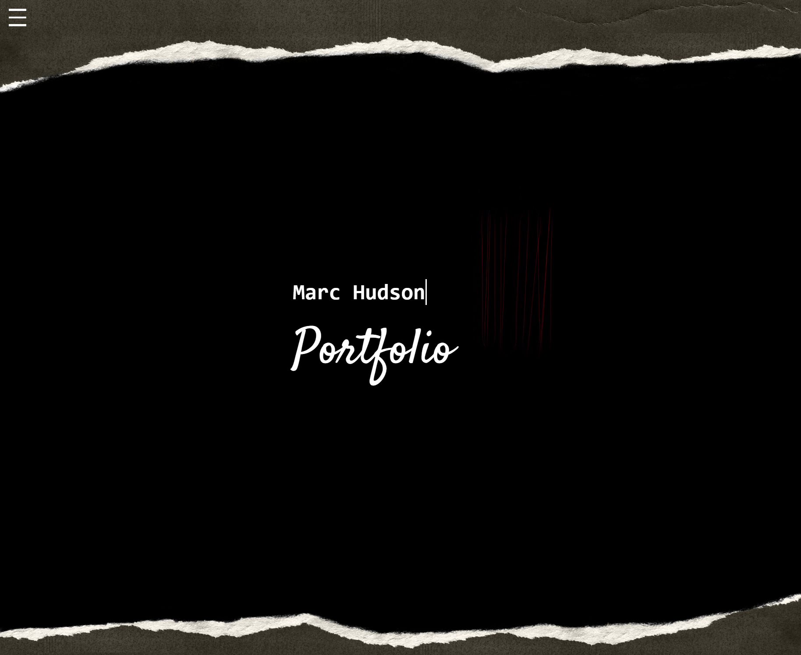
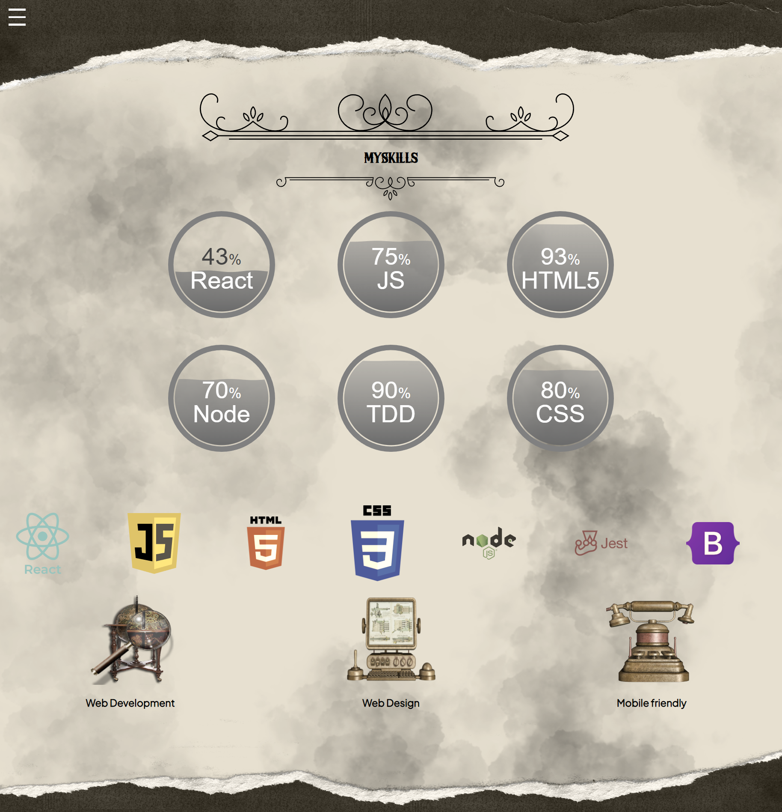
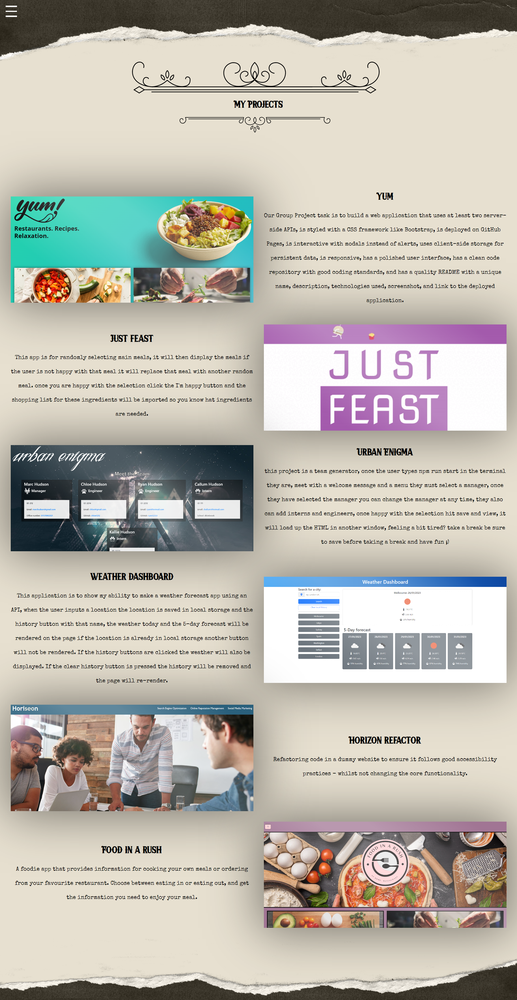

# Marc hudson react portfolio

## Table of Contents
* [Description of application](#description)
* [Installation instructions](#installation)
* [Usage of application](#usage)


* [Questions](#questions)
* [Application contributors](#contributors)
* [Link to deployed application](#link-to-deployed-application)
* [Screenshots of deployed application](#screenshots)


## Description
This is my main prtfolio built with react and scss, this uses an aray of packeges, it has landing page with my name, an about me section with a downloadable link to my cv.
it has a skills exction showing my confedence with the skills i have, and a project page with pictures of my projects, if you click the pictre it will take you to the deployed page or repo containg the project 


## Installation
```
npm i 
```

## Usage
```
npm start
```


## Questions
- Message me at: [marchudson26](https://github.com/marchudson26)
- Email me at: [Marrchudson2601@gmail.com](mailto:Marrchudson2601@gmail.com)

## Contributors
- 

## Link to deployed application
https://fictional-spork-react-portfolio.vercel.app

## Screenshots/ Videos




